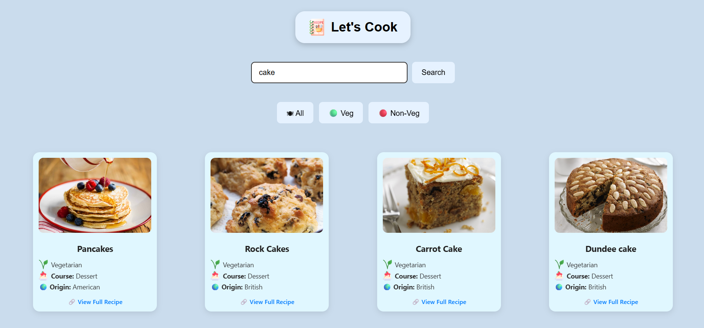

Here is a **clean, professional, and minimal `README.md`** you can copy-paste into your project. It includes:

* Project name
* Short description
* Features
* Technologies used
* Screenshot

---

### ✅ Final `README.md` (Copy this)

```markdown
# 🧑‍🍳 Let's Cook

A responsive recipe finder app built using React that allows users to search for meals, filter by vegetarian/non-vegetarian and course type (starter, main course, dessert), and view full recipes.

## 🚀 Features

- Live meal search with TheMealDB API
- Filters for Veg / Non-Veg / All
- Category emojis (starter, main course, dessert)
- Responsive design
- Emoji-based UI for better user experience

## 🛠️ Tech Stack

- **Frontend:** React, HTML, CSS, JavaScript
- **API:** TheMealDB
- **Version Control:** Git & GitHub

## 📸 Screenshot




```markdown

```


